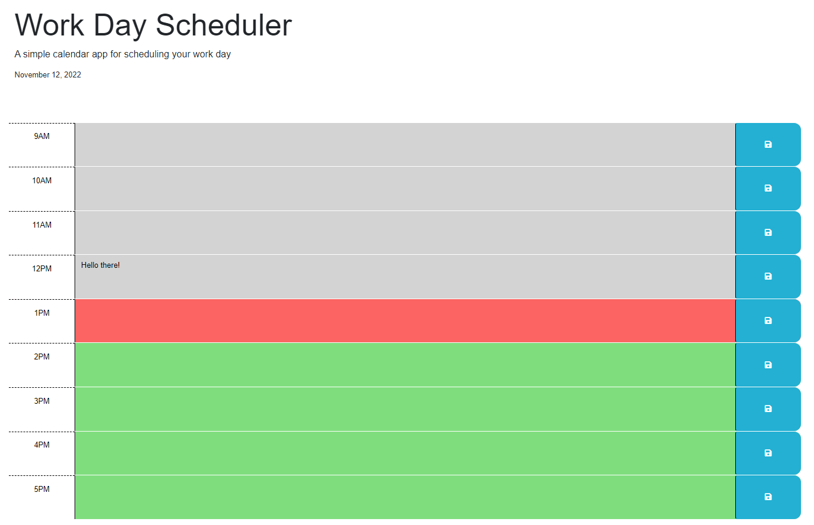

# 05 Third-Party APIs: Work Day Scheduler

## Acceptance Criteria

```md
GIVEN I am using a daily planner to create a schedule
WHEN I open the planner
THEN the current day is displayed at the top of the calendar
WHEN I scroll down
THEN I am presented with timeblocks for standard business hours
WHEN I view the timeblocks for that day
THEN each timeblock is color coded to indicate whether it is in the past, present, or future
WHEN I click into a timeblock
THEN I can enter an event
WHEN I click the save button for that timeblock
THEN the text for that event is saved in local storage
WHEN I refresh the page
THEN the saved events persist
```

## Description
### This project was for DU's coding boot camp. This was our first project we were able to use JQuery to help with coding JavaScript and it made the process much shorter and easier. I'm glad I was able to learn more about using it because it frees up a lot of time and helps make the development process much easier.  

## Credits
### Thank you to my instructor and my TA's for answering my questions along the way. And thanks to the learncode.academy for their helpful YouTube tutorials.  

## Deployed site

https://alester77.github.io/Schedule/

